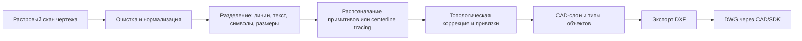
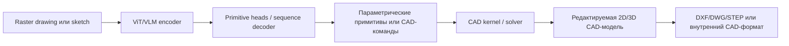

# Современные ИИ-методы векторизации растровых технических чертежей и генерации CAD-форматов

## Исполнительное резюме

Состояние области в середине 2026 года можно описать так: полностью «чистый» end-to-end переход от растрового технического чертежа к промышленно пригодному DWG/DXF только силами одной ИИ-модели в открытой литературе встречается редко. На практике лучшие результаты дает гибридная схема: нейросетевой этап выполняет понимание чертежа, очистку, выделение примитивов, символов, размеров и топологии, а затем детерминированный CAD-слой экспортирует результат в DXF/DWG или в последовательность CAD-операций. Это видно и по научным работам по векторизации, и по VLM/диффузионным системам для CAD, и по коммерческим продуктам, где ИИ обычно «читает» чертеж, а запись в CAD-формат выполняется уже через движок/SDK. citeturn23search8turn14view1turn22search0turn14view0turn8search0turn8search4

Наиболее зрелые направления сейчас четыре. Первое — нейросетевые векторизаторы line drawing/technical drawing: Deep Vectorization of Technical Drawings, Deep Line Drawing Vectorization, Deep Sketch Vectorization. Они оптимизируют геометрию и, что важнее, топологию соединений, а не просто трассируют пиксели. Второе — VLM/трансформерные модели, которые интерпретируют инженерный рисунок как изображение или как набор примитивов и предсказывают параметрические сущности: PICASSO, PHT-CAD, CadVLM, CAD2Program. Третье — диффузионные модели для генерации CAD-эскизов и командных последовательностей: SketchDNN, RECAD, CADCrafter, HouseDiffusion. Четвертое — графовые и vector-native сети для символики и структурного разбора: GAT-CADNet, CADTransformer, VecFormer. citeturn14view2turn23search0turn25search2turn14view1turn27view4turn37view0turn14view3turn21search2turn19view0turn14view0turn20view0turn33view1turn32view0turn16search2

Если задача — **оцифровка архивных бумажных чертежей**, то лучший практический выбор сегодня — pipeline из: очистки/дешумления, AI-OCR и segmentation, распознавания CAD-примитивов или centerline-tracing, затем нормализации геометрии и записи в DXF, а DWG получать downstream через CAD/SDK. Если задача — **редактирование и поддержание инженерного смысла**, то предпочтительнее модели, которые восстанавливают не полилинии, а параметрические примитивы и ограничения. Если задача — **генерация по эскизу**, то сильнее всего выглядят PICASSO, CadVLM, Free2CAD, RECAD и SketchDNN. Если задача — **подготовка к 3D-моделированию**, то наиболее перспективны PHT-CAD, CAD2Program, CADCrafter и Drawing2CAD, потому что они строят либо параметры примитивов, либо полные CAD-operation sequences. citeturn39view0turn27view5turn38view1turn14view1turn27view4turn5search15turn19view0turn21search2turn14view3turn14view0turn31view0

Ключевое ограничение области в том, что **метрики CAD-стандартов** — соответствие ЕСКД/ISO/ASME, корректность слоев, аннотаций, штампов и размеров как формально валидных CAD-объектов — почти никогда не являются основной исследовательской метрикой. Исследования обычно измеряют IoU, Chamfer Distance, ParamMSE, PQ, validity/invalid rate, command accuracy и т. п. Это означает, что даже очень сильная модель требует поствалидации перед интеграцией в промышленный CAD/PLM-контур. Для этапа «готовый DWG в производство» это, вероятно, самый важный практический вывод. citeturn14view2turn14view1turn27view4turn14view0turn32view0turn33view1

## Ландшафт методов и чем ИИ отличается от обычной попиксельной векторизации

Классическая попиксельная векторизация полезна как контекст, но для технических чертежей ее уже недостаточно. Potrace и VTracer решают задачу трассировки битмапа в сглаженные кривые и SVG/DXF-подобные контуры, однако они в основном работают с контуром изображения, а не с инженерной семантикой: не различают размерную линию, осевую, контур детали, штриховку, символ двери или текст как CAD-объект. Поэтому они хороши как baseline или постпроцессор, но не как полноценная «инженерная» система понимания чертежа. citeturn26search0turn26search1turn26search12

В ИИ-подходах произошел сдвиг от «trace every dark pixel» к «reconstruct the latent engineering structure». Это хорошо видно на трех поколениях методов. В ранних learning-based системах, таких как Raster-to-Vector для floorplans, CNN сначала предсказывает junction/primitive representation, а затем integer programming восстанавливает геометрически и топологически согласованный план. В Deep Vectorization of Technical Drawings добавляется глубокая очистка изображения, трансформерная оценка примитивов и модуль перцептивного слияния, что уже нацелено на реальную техническую графику. В более свежих системах, таких как PICASSO, PHT-CAD и CAD2Program, изображение вообще воспринимается как мультимодальный источник для вывода параметрических примитивов или CAD-программы, а не просто списка кривых. citeturn17search1turn23search8turn14view1turn22search0turn14view3

Отдельно важно, что generic VLM «из коробки» пока редко достаточно точен для инженерной геометрии. И исследование VLMs4Design, и специализированные работы по инженерным чертежам показывают, что мультимодальные модели полезны для reasoning, OCR и структурного извлечения, но когда требуется точный параметрический CAD-вывод, исследователи добавляют специализированные регрессионные головы, CAD-aware tokenization, differentiable rendering или CAD kernels. Иначе модель склонна к геометрическим неточностям и «галлюцинациям». citeturn4search7turn4search19turn4search15turn22search0turn14view1

Русскоязычная академическая публикация по теме тоже уже есть: в работе БелГУ 2024 года описан нейросетевой подход к векторизации бумажной конструкторской документации, где предлагаются отдельные архитектуры для распознавания рамки, основной надписи, проекций, размерных линий и примитивов изделия, а для иерархической взаимосвязанной векторизации используется графовая нейронная сеть. Это не крупнейший мировой benchmark, но это хороший сигнал, что проблематика уже локализуется и в русскоязычном исследовательском поле. citeturn12view0

## Архитектуры и обучающие датасеты

По архитектурам поле уже достаточно четко делится на несколько классов. **VLM/MLLM-подходы** используют визуальный энкодер уровня ViT и языковой/кодовый декодер либо регрессионные головы. Примеры: CAD2Program кодирует raster image технического чертежа ViT-моделью и autoregressive-предсказывает текстовую программу параметрической 3D-модели; PHT-CAD совмещает VLM с четырьмя регрессионными головами для point/line/circle/arc; CadVLM использует image encoder уровня ViT-MAE и text/code decoder уровня CodeT5+ для задач автодополнения и автоконстрейнтинга CAD sketches. citeturn14view3turn22search0turn37view1

**Диффузионные модели** в CAD сейчас встречаются в двух формах. Первая — генерация в пространстве параметров/примитивов: SketchDNN совместно моделирует непрерывные параметры и дискретные типы примитивов через Gaussian-Softmax diffusion. Вторая — генерация через raster или latent sketch representation с последующим переводом в CAD: RECAD генерирует raster sketches и extrusion boxes двухстадийной diffusion-схемой, а затем превращает их в CAD-модели; CADCrafter — latent diffusion model для генерации CAD command sequences из изображений с добавлением geometry-conditioned encoder и validity-based checker. citeturn21search2turn19view0turn14view0

**Сегментация, трассировка и neural vectorization** чаще всего используют CNN/U-Net/ResNet плюс трансформерные или graph-based блоки. В Deep Vectorization of Technical Drawings очистка делается U-Net, затем ResNet+Transformer извлекают примитивы на patch-level. Deep Line Drawing Vectorization использует multi-task CNN для centerline extraction и junction detection, а потом отдельный этап topology reconstruction. Deep Sketch Vectorization идет через unsigned distance field и neural dual contouring, совмещая нейросетевую реконструкцию и геометрический постпроцессинг. citeturn6view2turn23search0turn25search2

**Графовые сети** особенно сильны там, где чертеж уже представлен в виде векторных сущностей или где нужно уловить отношения между примитивами. GAT-CADNet представляет CAD drawing как граф примитивов и предсказывает паноптическую символику через attention и adjacency; CADTransformer токенизирует графические примитивы и добавляет neighbor-aware attention, hierarchical aggregation и positional encoding; VecFormer в 2025 году показывает, что line-based representation может еще лучше сохранять геометрическую непрерывность и доводит PQ до 91.1 на задаче panoptic symbol spotting. citeturn32view1turn32view0turn16search2

Ниже — компактная сводка самых используемых открытых датасетов и бенчмарков.

| Датасет | Что содержит | Масштаб | Для чего используется | Источник |
|---|---|---:|---|---|
| FloorPlanCAD | Векторные floor plans с line-grained аннотациями 30 категорий | более 10 000 планов | symbol spotting, semantic/panoptic parsing | paper citeturn34view0 |
| SketchGraphs | Параметрические CAD sketches и constraints | крупный публичный CAD-sketch benchmark; в CadVLM упоминается как основной baseline dataset | sketch generation, autocompletion, constraints | paper citeturn14view1turn37view1 |
| CAD as Language | Параметрические CAD sketches из Onshape | более 4.7 млн sketch-объектов | language-like modeling of CAD sketches | paper citeturn30search2turn37view3 |
| DeepCAD dataset | CAD construction sequences | 178 238 моделей | generative CAD, command sequences | paper citeturn35view0 |
| ParaCAD | Геометрия + annotation layers для инженерных чертежей | более 10 млн train drawings + 3 000 real industrial test drawings | 2D parametric primitive analysis | paper/repo citeturn22search0turn27view4 |
| CAD-VGDrawing | Парные vector engineering drawings и CAD models | 161 407 CAD-моделей | SVG-to-CAD generation | paper citeturn31view0 |
| RealCAD | Реальные изображения, спаренные с CAD commands | размер в кратком описании не указан | real-world evaluation image-to-CAD | paper citeturn6view0turn14view0 |
| RPLAN | Векторные floorplans | 60 000 floorplans в HouseDiffusion | diffusion floorplan generation | paper citeturn20view2 |

## Рабочие пайплайны от растрового чертежа до DXF, DWG и параметрического CAD

Для **оцифровки сканов технических чертежей** практический pipeline сегодня обычно строится так: входной raster scan проходит очистку, выравнивание и сегментацию; затем отдельные модели разбирают linework, текст, dimensions и symbols; после этого выполняется либо primitive fitting, либо centerline tracing, либо neural vectorization с topology repair; а уже затем векторные сущности записываются в DXF/SVG и при необходимости конвертируются в DWG. Именно в таком духе работают Deep Vectorization of Technical Drawings, DARE ONE и BeesAI Raster2CAD. citeturn6view2turn39view0turn27view5



Для **генерации параметрического CAD или перехода к 3D-модели** pipeline другой: изображение или vector drawing кодируются VLM/Transformer-энкодером, далее декодируется либо последовательность примитивов, либо текстовая/командная CAD-программа, после чего CAD kernel строит редактируемую 2D/3D-модель. В CAD2Program это текстовая программа параметрической модели; в CADCrafter — CAD command sequences; в Drawing2CAD — операция за операцией из vector drawings; в PICASSO и PHT-CAD — parametric primitives, которые далее можно импортировать в CAD. citeturn14view3turn14view0turn31view0turn14view1turn27view4



Особенно важен слой **перевода растрового вывода диффузионных моделей в вектор**. В открытых работах встречаются четыре стратегии. Первая — contour extraction и геометрическое упрощение; RECAD прямо пишет, что упрощает контуры алгоритмом Douglas–Peucker перед экструзией. Вторая — centerline tracing, ориентированный на CAD, как у DARE ONE, где линии переводятся не в двойной outline, а в одну центральную ось. Третья — neural topology reconstruction: в Deep Line Drawing Vectorization центр-линии и развилки сначала предсказываются CNN-сетью, а затем восстанавливается связность. Четвертая — implicit field + dual contouring, как в Deep Sketch Vectorization, где unsigned distance field преобразуется в вектор через neural dual contouring и topology refinement. citeturn20view3turn39view0turn23search0turn25search2

На уровне форматов экспорт в **DXF** сегодня заметно проще, чем в **DWG**. `ezdxf` официально позволяет создавать, читать, модифицировать и записывать DXF-документы и подходит для автоматизации pipeline после работы модели. Для DWG, где промышленная совместимость выше, чаще используют ODA Drawings SDK или сохранение через саму CAD-систему. Поэтому в исследованиях часто виден вывод в sequence/SVG/DXF-like representation, а прямой нейронный «DWG emission» почти не описывается. Это не запрет, а индикатор зрелости экосистемы: ИИ отвечает за понимание/генерацию, а запись в корпоративный формат делает специализированный SDK. citeturn8search0turn8search9turn8search4turn8search1

Ниже — минимальный пример постобработки, когда ИИ уже вернул примитивы, а вы хотите сохранить результат в DXF через `ezdxf`. Официальная документация прямо поддерживает такой сценарий. citeturn8search0turn8search9

```python
import ezdxf

doc = ezdxf.new("R2018")
msp = doc.modelspace()

# Примеры примитивов, распознанных ИИ
msp.add_line((0, 0), (100, 0), dxfattribs={"layer": "contour"})
msp.add_line((100, 0), (100, 50), dxfattribs={"layer": "contour"})
msp.add_circle(center=(40, 20), radius=10, dxfattribs={"layer": "holes"})
msp.add_text("M8", dxfattribs={"layer": "annotation", "height": 2.5}).set_placement((10, 60))

doc.saveas("recognized_drawing.dxf")
```

## Точность, метрики и типовые ошибки

Метрики в этой области важно читать очень аккуратно: они редко сопоставимы между работами, потому что сравнивают разные задачи. Для line/vector reconstruction типичны IoU, Hausdorff distance, Chamfer-like distances и число примитивов. Для CAD sketch parameterization — Accuracy, ParamMSE, ImgMSE, CD. Для symbol spotting — PQ, RQ, SQ, F1, AP. Для CAD sequence generation — ACCcmd, ACCparam, invalid rate, Med CD. Для unconditional CAD generation — COV, MMD, JSD, Valid, Novel, Unique. citeturn14view2turn14view1turn32view0turn33view1turn14view0turn19view0

| Система | Задача | Основные результаты | Что это значит на практике | Источник |
|---|---|---|---|---|
| Deep Vectorization of Technical Drawings | raster → vector primitives | на PFP: IoU 86/88, dH 25 px, dM 0.2 px, 1331 примитив; на DLD: IoU 79/82 | хорошая геометрия даже на деградированных line drawings | paper citeturn14view2 |
| PICASSO | raster sketch → parametric primitives | precise sketches: Acc 0.751, ParamMSE 281, ImgMSE 0.075, CD 0.729; hand-drawn: Acc 0.658, CD 1.090 | сильный few-shot/zero-shot baseline для параметризации эскизов | paper citeturn14view1 |
| PHT-CAD | engineering drawing → atomic CAD components | hand-drawn: Acc 0.795, ParamMSE 11, ImgMSE 0.005, CD 0.010; zero-shot: Acc 0.923, CF1 0.860, PF1 0.910 | один из самых сильных публичных результатов именно для точного primitive analysis | repo/paper summary citeturn27view4 |
| CADTransformer | vector CAD panoptic spotting | PQ до 0.689 на FloorPlanCAD | transformer хорошо работает на line-level symbol spotting | paper citeturn32view0 |
| GAT-CADNet | graph-based panoptic spotting | PQ 0.737, RQ 0.807, SQ 0.914 | графовая модель лучше учитывает связи и adjacency примитивов | paper citeturn33view1 |
| CADCrafter | image → CAD command sequences | RealCAD multi-view: ACCcmd 83.18, ACCpara 66.89, Med CD 0.062, IR 0.067 | одна из лучших diffusion-based систем для image-to-CAD | paper citeturn14view0 |
| RECAD | raster sketch + extrusions → CAD | COV 86.67, MMD 0.768, JSD 0.593, Valid 99.65 | сильная генерация и очень высокая валидность CAD-моделей | paper citeturn19view0 |
| SketchDNN | diffusion CAD sketch generation | FID 7.80 против 16.04 у baseline; NLL 81.33 против 84.8 | diffusion заметно улучшает качество генерации sketch-domain | paper citeturn21search2 |
| Drawing2CAD | vector drawings → CAD sequences | при 4-view input: ACCcmd 82.43, ACCparam 76.09, IR 20.31, MCD 10.88 | vector input уже сейчас выигрывает у raster baselines для инженерных drawings | paper citeturn31view0 |
| CAD2Program | 2D CAD drawing → 3D parametric model | с annotation layer: retrieval acc 93.80, F1 82.76, parameter acc 97.21 | аннотации помогают VLM, а не мешают ему | paper citeturn15view1 |

Типовые ошибки довольно устойчивы от работы к работе. Во-первых, **шум, разрывы линий, фон, пыль, перекос скана** все еще сильно влияют на итог; Deep Vectorization специально выделяет cleaning stage, а DARE ONE прямо предупреждает, что пятна и пыль могут стать лишней геометрией. Во-вторых, **line thickness и raster artifacts** мешают image-based methods восстанавливать точную геометрию; Drawing2CAD отдельно мотивирует отказ от raster input именно из-за масштаба, толщины линий и артефактов. В-третьих, **тексты и annotations** одновременно и полезны, и опасны: CAD2Program показывает, что annotation layer повышает качество реконструкции, но многие датасеты и older pipelines вообще удаляют тексты, чтобы не усложнять задачу. В-четвертых, **dense hatching, декоративные штрихи и сложные заливки** в открытых benchmark’ах обычно либо ослаблены, либо вовсе не акцентированы; явных полноценных сравнений по штриховке в большинстве работ не указано/не найдено. citeturn6view2turn39view0turn31view0turn15view1turn34view0

Отдельная большая проблема — **CAD-standard compliance**. Работы хорошо оценивают геометрию, топологию и валидность командных последовательностей, но почти не дают формальной метрики соответствия ГОСТ/ЕСКД/ISO-оформлению чертежа. В ARES 2027 заявлена генерация standards-aligned symbols, однако для академических систем такой метрики почти нет. Если вам нужен production-grade CAD, необходим внешний этап проверки слоев, размерных стилей, текста, блоков, unit system и топологической замкнутости. В открытых статьях это чаще всего не указано/не найдено. citeturn38view0turn14view1turn14view0turn31view0

## Инструменты и проекты

Ниже — практическая сводка по инструментам. Я разделил ее на открытые research-проекты и коммерческие продукты. Для части коммерческих решений точная архитектура не раскрывается; в таких случаях указано «не указано».

### Open-source и research-проекты

| Название | Модель или архитектура | Вход → выход | Форматы | Лицензия | Ссылки |
|---|---|---|---|---|---|
| CADTransformer | Transformer для panoptic symbol spotting по графическим примитивам | vector CAD primitives → symbol labels / panoptic parsing | FloorPlanCAD / vector entities; экспорт пользователем | MIT | repo/paper citeturn27view0turn32view0 |
| GAT-CADNet | Graph Attention Network с RSE и CEE | граф примитивов → adjacency + panoptic symbols | vector CAD graphs | код найден; лицензия не указана/не найдено | paper/repo citeturn16search17turn32view1 |
| DeepCAD | Transformer autoencoder + latent GAN | CAD sequences → CAD generation / reconstruction | внутренние CAD sequences; downstream CAD export | MIT | repo/paper citeturn27view1turn35view0 |
| Drawing2CAD | Seq2seq Transformer с dual decoder | SVG engineering drawings → CAD operation sequences | SVG → CAD ops | MIT | repo/paper citeturn21search6turn31view0 |
| SketchDNN | Joint continuous-discrete diffusion | CAD sketch distribution → generated parametric sketches | CAD sketch primitives | лицензия не указана/не найдена в видимом описании | repo/paper citeturn27view2turn21search2 |
| PHT-CAD | VLM + 4 regression heads | raster engineering drawing → point/line/circle/arc primitives | изображения → primitives | лицензия не указана/не найдена | repo/paper citeturn27view4turn22search0 |
| Deep Sketch Vectorization | Двухстадийная neural UDF + neural dual contouring | clean raster line drawing → vector graphics | raster → vector/SVG-class output | MIT | repo/paper citeturn27view3turn25search2 |
| FloorplanTransformation | CNN + integer programming | raster floorplan → vector floorplan | raster → vector floorplan | код открыт; лицензия не указана/не найдена | repo/paper citeturn17search3turn17search1 |

### Коммерческие продукты

| Название | Что заявляет поставщик | Вход → выход | Форматы | Лицензия или раскрытие модели | Ссылки |
|---|---|---|---|---|---|
| BeesAI Raster2CAD | AI layer recognition, OCR, primitive reconstruction; Lite/Pro/Ultra | PDF/JPG/PNG/TIFF/SVG → DXF/DWG | DXF, DWG | коммерческий SaaS; архитектура не указана | docs citeturn27view5 |
| Print2CAD 2025 AI | AI raster/vector PDF to editable DWG/DXF + OCR | PDF/raster → DWG/DXF | DWG, DXF | коммерческий desktop; архитектура не указана | Autodesk listing citeturn38view1 |
| DARE ONE Raster Converter | AI recognition engine, OCR, centerline tracing | scanned PDF/JPG/PNG → editable CAD | DXF, DWG, JWW | коммерческий web-service; проприетарно | official blog/docs citeturn39view0turn10search0 |
| ARES 2027 | AI-assisted block generation, AI CAD assist, PDF-to-DWG/BIM-to-DWG automation | text/PDF/BIM → DWG workflows | DWG, DXF, PDF, STEP | коммерческий; модель не раскрыта, OpenAI-powered AI assist | official docs citeturn38view0 |

Ниже — несколько типичных команд из открытых репозиториев, полезных для быстрого старта. Эти команды опубликованы самими авторами проектов. citeturn28view1turn28view2turn28view4

```bash
# SketchDNN
git clone https://github.com/Sathware/SketchDNN.git
conda env create -f environment.yaml
python3 train.py

# DeepCAD
pip install -r requirements.txt
conda install -c conda-forge pythonocc-core=7.5.1
python train.py --exp_name newDeepCAD -g 0
python test.py --exp_name newDeepCAD --mode rec --ckpt 1000 -g 0

# CADTransformer
CUDA_VISIBLE_DEVICES=0 python -m torch.distributed.launch --nproc_per_node=1 train_cad_ddp.py \
  --data_root /PATH/TO/PROJECT_DIR/data/FloorPlanCAD \
  --pretrained_model /PATH/TO/PROJECT_DIR/pretrained_models/hrnetv2_w48_imagenet_pretrained.pth --test_only

python scripts/evaluate_pq.py \
  --raw_pred_dir /PATH/TO/SAVE_DIR/IN/PREVIOUS/STEP \
  --svg_pred_dir /PATH/TO/PROJECT_DIR/FloorPlanCAD/svg_pred \
  --svg_gt_dir /PATH/TO/PROJECT_DIR/FloorPlanCAD/svg_gt \
  --thread_num 6
```

## Практические рекомендации по выбору подхода

Если ваша задача — **оцифровка бумажных или сканированных чертежей**, то наиболее рационален не «чистый» text-to-CAD, а pipeline класса *cleanup + OCR + primitive recognition + DXF export*. В открытой науке для этого лучше всего подходят идеи из Deep Vectorization, Deep Line Drawing Vectorization и PHT-CAD; в готовых продуктах — BeesAI Raster2CAD, DARE ONE и Print2CAD AI. Для корпоративного результата я бы советовал целиться в DXF как промежуточный мастер-формат и уже затем конвертировать/сохранять в DWG через CAD-систему или ODA SDK. citeturn14view2turn23search0turn27view4turn27view5turn39view0turn38view1turn8search4

Если вам нужно **редактирование и семантически чистый CAD**, избегайте методов, которые отдают только outline-полилинии. Предпочитайте модели, способные предсказать линии, дуги, окружности, constraints и аннотации как отдельные сущности: PICASSO, PHT-CAD, CadVLM. Для floorplan-like domains — GAT-CADNet, CADTransformer и VecFormer, потому что там уже хорошо отрабатывается line-level semantics. citeturn14view1turn27view4turn37view1turn33view1turn32view0turn16search2

Если цель — **генерация по эскизу или частичному наброску**, то сейчас наиболее интересны CadVLM, PICASSO, RECAD, SketchDNN и Free2CAD. CadVLM уже показывает сильный прирост в автодополнении sketch-domain; RECAD удобен, когда пользователь мыслит через raster sketch и extrusion boxes; SketchDNN силен как генератор распределения CAD sketches; Free2CAD хорош как мост от свободной руки к командной модели. citeturn37view1turn14view1turn19view0turn21search2turn5search15

Если задача — **подготовка к 3D-моделированию или reverse engineering по чертежам**, то лучший выбор — модели, которые выдают не просто 2D-вектор, а параметрическую программу или набор примитивов для CAD kernel: CAD2Program, CADCrafter, Drawing2CAD, PHT-CAD. Здесь особенно важно наличие annotations: CAD2Program прямо показывает, что annotation layer повышает точность реконструкции, а не ухудшает ее. Для сборок/компоновок публичных raster-to-CAD примеров меньше; у CAD2Program описан сценарий со шкафами, собираемыми из библиотеки примитивов, а для полноценных промышленных multi-part assembly задач открытых end-to-end решений пока мало — не указано/не найдено. citeturn14view3turn15view1turn14view0turn31view0turn27view4turn7search1

Для **интеграции с CAD/PLM** рекомендую мыслить модульно. ИИ должен работать как слой восприятия и генерации, а не как единственная точка истины. После него нужен CAD-экспорт, геометрическая валидация, проверка текстов/размеров/слоев и только затем загрузка в PDM/PLM. На уровне форматов DXF проще автоматизировать через `ezdxf`; DWG — через ODA Drawings SDK или через сохранение в AutoCAD/ARES/BricsCAD-классе продуктов. Прямых описаний полноценных PLM-коннекторов в академических работах по raster-to-CAD почти нет; в коммерческих системах встречается интеграция с REST API, облачным хранилищем и DWG/BIM automation, как у BeesAI и ARES, но именно «ИИ-векторизация → PLM без промежуточной проверки» в источниках не обнаружена. citeturn8search0turn8search4turn27view5turn38view0

В сухом остатке: для **бумажных архивов** берите AI-assisted raster-to-DXF pipeline; для **редактируемого инженерного CAD** — primitive/constraint recovery; для **эскизной генерации** — VLM/diffusion sketch models; для **3D reconstruction из 2D drawings** — sequence/program generation. А вот полностью «магический» нейронный перевод любого грязного скана сразу в безупречный DWG, удовлетворяющий CAD-стандартам без постобработки, в открытых надежно подтвержденных источниках пока не найден. citeturn23search8turn14view1turn19view0turn14view3turn14view0turn31view0
